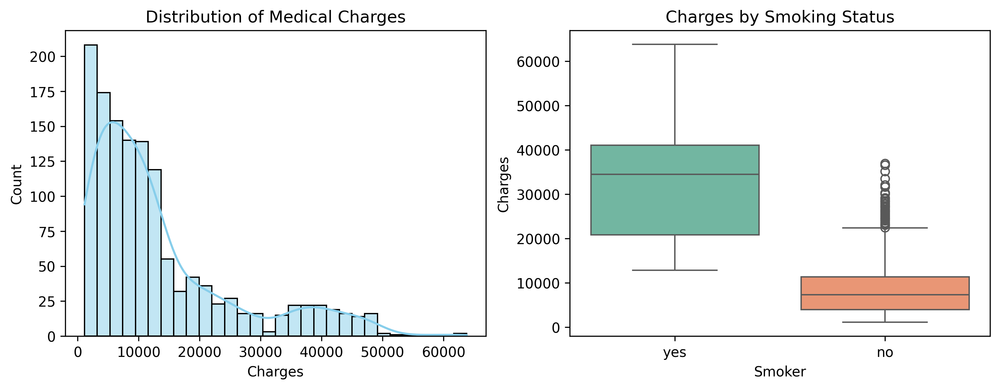

# 📈 Linear Regression: From Scratch vs. Scikit-Learn

A Machine Learning benchmark project comparing **Linear Regression built from scratch** (using Gradient Descent and Closed-Form OLS) against **Scikit-Learn's `LinearRegression`** baseline model.

---

## 📌 Project Overview
The goal of this project is to implement core linear regression algorithms from first principles using NumPy, evaluate their mathematical convergence, and compare their performance against standard library implementations on real-world data.

### Highlights:
* **Custom Gradient Descent (GD):** Full vectorized implementation of iterative gradient optimization.
* **Custom Ordinary Least Squares (OLS):** Closed-form parameter estimation using the Normal Equation $(\mathbf{X}^T \mathbf{X})^{-1} \mathbf{X}^T \mathbf{y}$.
* **Scikit-Learn Baseline:** Direct model comparison and performance benchmarking.
* **Exploratory Data Analysis (EDA) & Preprocessing:** Data visualization, categorical encoding, train-test splitting, and feature scaling (`StandardScaler`).

---

## 📊 Exploratory Data Analysis & Insights Report

### Key Findings:
1. **Target Variable (`charges`):** Highly right-skewed distribution. Most individual medical claims fall under $15,000, while a long tail extends up to $60,000+.
2. **Smoking Status:** The strongest predictor of medical costs. Smokers consistently experience significantly higher charges across all age groups and BMI ranges.
3. **Feature Scaling:** Scaling continuous features (`age`, `bmi`) with `StandardScaler` was essential for ensuring steady gradient updates and fast convergence in Gradient Descent.

   

---

## 🏆 Model Performance & Benchmark Results

All models were evaluated on an **80/20 train-test split** (scaled test set of 268 samples):

| Model | $R^2$ Score | MAE ($) | RMSE ($) | Key Notes |
| :--- | :--- | :--- | :--- | :--- |
| **Custom OLS** | **0.783593** | **4,181.19** | **5,796.28** | Exact match with Scikit-Learn down to 6 decimal places. |
| **Scikit-Learn OLS** | **0.783593** | **4,181.19** | **5,796.28** | Analytical baseline. |
| **Custom GD** | **0.783590** | **4,181.23** | **5,796.32** | Converged within $0.000003$ of global minimum ($\alpha=0.01$). |

### Takeaways:
* **Mathematical Accuracy:** The custom OLS implementation validates that matrix inversion and transposition logic match Scikit-Learn's underlying linear algebra solvers.
* **Gradient Descent Convergence:** With properly scaled features, iterative Gradient Descent reaches near-identical performance to the exact closed-form solution.

---

## 🛠️ Tech Stack & Requirements

* **Python 3.x**
* **NumPy** — Vectorized matrix operations & formula implementations
* **Pandas** — Data manipulation & cleaning
* **Matplotlib & Seaborn** — Exploratory data visualization
* **Scikit-Learn** — Feature scaling, data splitting, and model benchmarking

### To run the project locally:

```bash
git clone [https://github.com/Ysoham-newjourney2/linear-regression-scratch-vs-sklearn.git](https://github.com/soham-newjourney2/linear-regression-scratch-vs-sklearn.git)
cd linear-regression-scratch-vs-sklearn
pip install numpy pandas matplotlib seaborn scikit-learn
jupyter notebook
```

## 🏷️ Dataset Citation & Acknowledgments

* **Dataset:** [Medical Cost Personal Datasets on Kaggle](https://www.kaggle.com/datasets/mirichoi0218/insurance)
* **Original Source:** Brett Lantz, *Machine Learning with R* (Packt Publishing)
* **Dataset License:** Database Contents License (DbCL) / Public Domain
